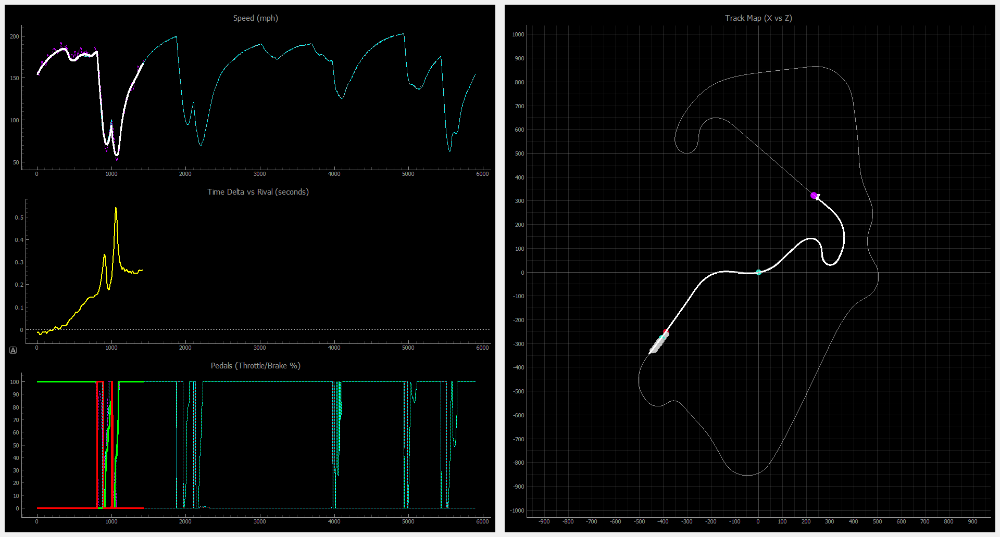

# F1 25 Real-Time Telemetry Plotter

A Python-based real-time telemetry plotter for F1 25. It provides high-frequency visualization of speed, pedal inputs, time deltas, and racing lines across dual windows, optimized for multi-monitor setups.



## Features
- **High-Resolution Telemetry**: Uses **World Position (X, Y, Z)** interpolation to provide smooth 60Hz telemetry data, even for Time Trial ghosts which the game usually restricted to ~1Hz.
- **Track Map Visualization**: A dedicated window showing the 2D path of all 22 cars, highlighted by team colors. Includes a **real-time steering wheel icon** that rotates based on your inputs.
- **Dual Window Layout**: Optimized for dual monitors; automatically detects and positions windows side-by-side on your second screen.
- **Cross-Window Sync**:
  - **Shared Marker**: Middle-click on any telemetry trace or the track map to place a synchronized yellow marker across all views.
  - **Synchronized Zoom**: Zooming or panning on any telemetry graph automatically pans and zooms the Track Map to focus on that specific section of the circuit.
- **Time Trial Mode**: Direct comparison against personal bests or rivals with smooth, non-quantized traces.
- **AI-Ready Recording**: Record full-grid telemetry to JSON files with built-in metadata for AI analysis and coaching.
- **Fading Lap History**: Previous laps remain visible on both the telemetry and the track map, gradually fading out so you can analyze consistency.

## Controls & Keybindings
All keys work globally across both windows:
- **`Middle Click`**: Place/Move shared data marker.
- **`Space`**: Clear shared marker.
- **`Left Click + Drag`**: Pan telemetry graphs.
- **`Right Click + Drag` / `Scroll`**: Zoom telemetry (Track Map follows).
- **`T`**: Toggle **Tyre Wear** plot.
- **`E`**: Toggle **Energy (ERS)** plot.
- **`R`**: Toggle **Recording** to file (saved in `recordings/` folder).
- **`S`**: Take a composite **Screenshot** of all open windows.
- **`Q`**: Quit the application.

## Prerequisites
1. **F1 25 Game**: Configured to output UDP telemetry.
2. **UDP Forwarding (Optional)**: If using SimHub, ensure it forwards packets to `127.0.0.1:20778`.
3. **Python 3.10+**: Recommended for modern PyQt5 support.

## Installation

1. Navigate to the project directory:
   ```bash
   cd telemetry
   ```

2. Install the required dependencies using `uv`:
   ```bash
   uv sync
   ```

## Usage

### Real-Time Plotter
Run the application to listen for live UDP data:
```bash
uv run telemetry
```

### Playback Mode
Review previously recorded sessions with full interactivity:
```bash
uv run telemetry-playback recordings/your_recording.parquet
```

#### Playback Controls:
- **Play/Pause**: Toggle playback using the button in the controls window.
- **Seek Slider**: Drag the slider to jump to any point in the recording.
- **Time Display**: Shows current playback time vs. total recording duration.
- **Interactive Sync**: All real-time features (Middle-click markers, synchronized zoom, fading history) work exactly as they do during live sessions.

### Configuration Options
- `--laps [N]`: Number of previous laps to maintain in history (default: 5).
- `--port [N]`: UDP port to listen on (default: 20778).

## How it works
The application reconstructs high-fidelity telemetry by calculating distance and speed from raw world coordinates rather than relying on the game's pre-calculated (and often throttled) fields. This ensures that the player's line and the ghost's line are perfectly comparable.

The X-axis uses a "Hybrid Distance" approach: syncing with the game's spline data (`m_lapDistance`) periodically but interpolating with high-precision world deltas between updates to ensure a jitter-free display.
