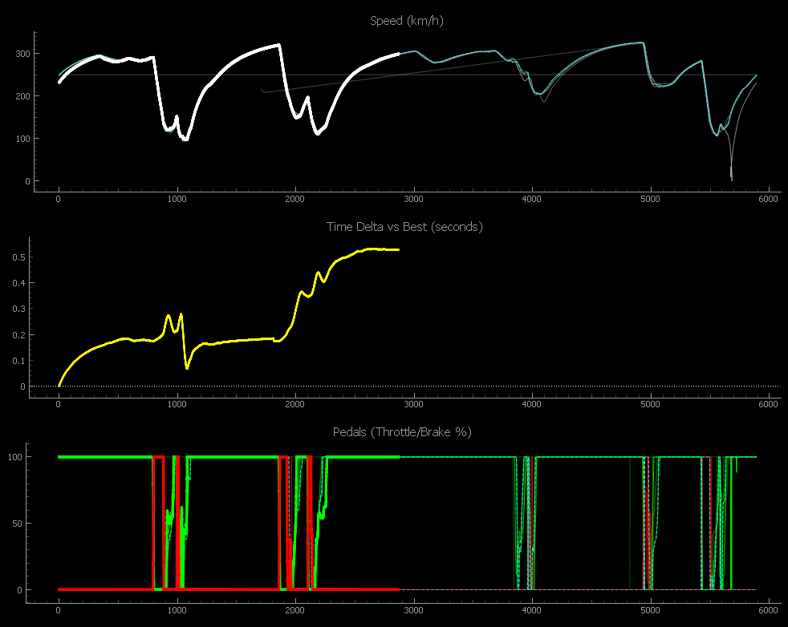

# F1 25 Real-Time Telemetry Plotter

A Python-based real-time telemetry plotter for F1 25. It displays speed, pedal inputs, time delta vs your best lap, tyre wear, and ERS energy, maintaining a history of previous laps with a fading effect.



## Features
- **Real-time Plotting**: High-performance visualization using `pyqtgraph`.
- **Dual Modes**: 
  - **Time Trial Mode**: Focuses on delta-time and comparison against your best lap.
  - **Race Mode**: Shows live telemetry for you and all 21 opponents (opponents shown with low alpha and team colors).
- **AI-Ready Recording**: Record full-grid telemetry to JSON files with built-in metadata for AI analysis and coaching.
- **Lap-by-Lap History**: Automatically detects new laps and stores the previous ones.
- **Configurable History**: Control how many previous laps are displayed.
- **Fading Effect**: Older laps gradually fade out, making it easy to compare your current performance against recent ones.

## Keybindings
- **`T`**: Toggle **Tyre Wear** plot.
- **`E`**: Toggle **Energy (ERS)** plot.
- **`R`**: Toggle **Recording** to file (saved in `recordings/` folder).

## Prerequisites
1. **SimHub**: Must be installed and running.
2. **UDP Forwarding**: Ensure SimHub is configured to forward UDP telemetry to `127.0.0.1` on port `20778`.
3. **Python 3.7+**: Make sure Python is installed on your system.

## Installation

1. Navigate to the project directory:
   ```bash
   cd telemetry_plotter
   ```

2. Install the required dependencies:
   ```bash
   pip install -r requirements.txt
   ```

## Usage

Run the application:
```bash
python main.py
```

### Configuration Options
You can configure the number of laps to maintain using the `--laps` argument:
```bash
python main.py --laps 10
```

If your SimHub is configured to forward to a different port, use the `--port` argument:
```bash
python main.py --port 20778
```

## How it works
The application listens for raw F1 25 binary telemetry packets forwarded by SimHub via UDP. It uses `PyQtGraph` for efficient real-time plotting.

The X-axis is based on `m_lapDistance`, allowing for perfect alignment of telemetry across different laps regardless of time variations.

Recorded JSON files include a metadata header describing the units and schema, making them easy to feed into AI models for automated driving analysis and coaching.
